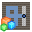
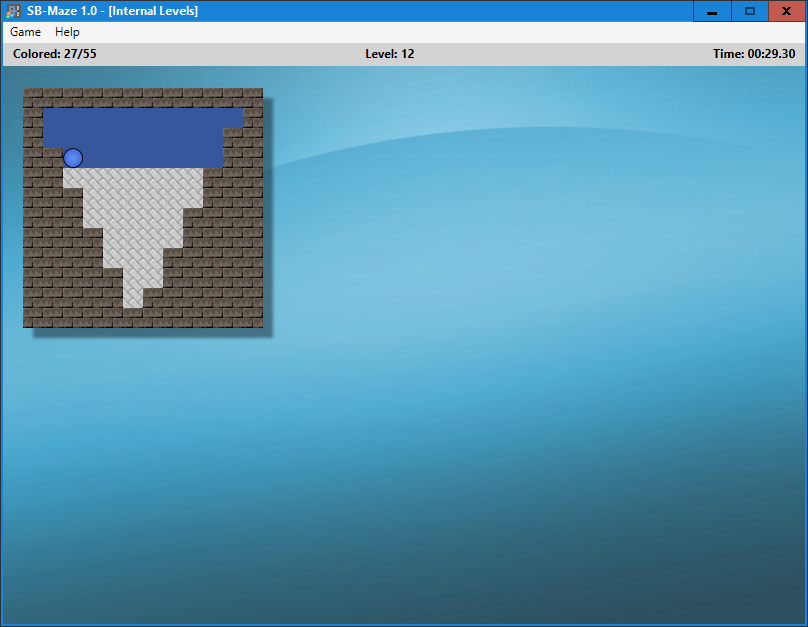
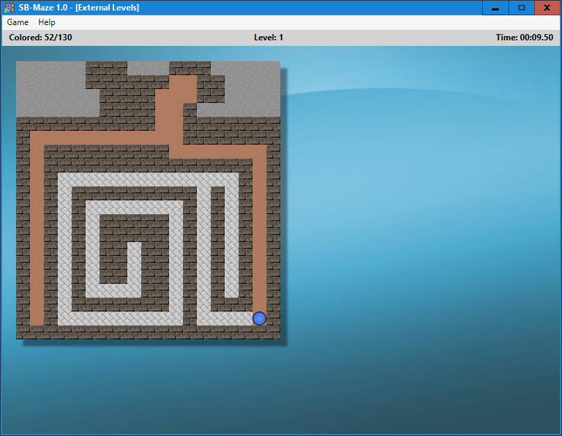

#  SB-Maze 

This game is AMAZE! for Android completly written from scratch for Small Basic 1.2 for Windows. The design is heavily inspired by the Commander X16 Version of the game:
CX16-Maze (https://www.commanderx16.com/forum/index.php?/files/file/4-cx16-maze/).
SB-Maze is a little puzzle-game with 50 levels, which takes around 15-20 min. to beat. In the future more may come, who knows...

#### Merry Christmas everyone!! 🎄

## How to create you own levels

To create your own levels you need the SB-Maze Level Editor. Before you do anything please read the help. Otherwise you will get problems.
You can find the editor here: https://github.com/Computer-Freak-2004/SB-Maze-Level-Editor

## Screenshots
 
 
 
